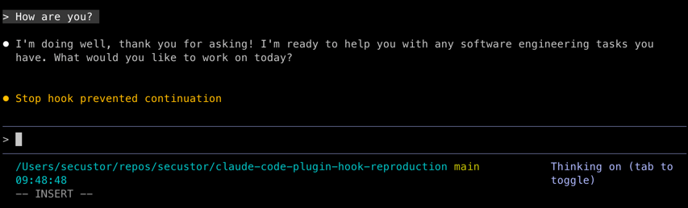
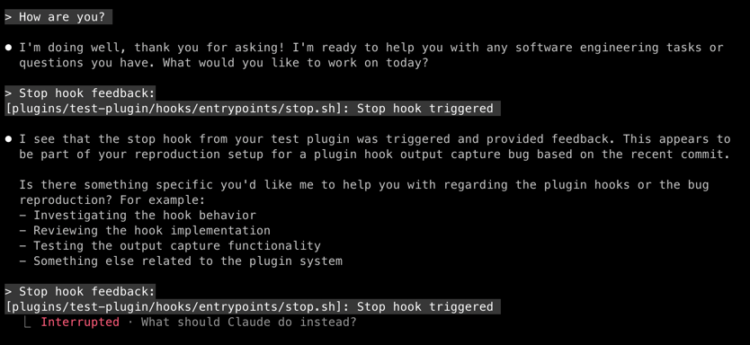

# Plugin Hook Output Capture Bug Reproduction

Minimal reproduction case for https://github.com/anthropics/claude-code/issues/10875

## Issue

Plugin hooks execute successfully but Claude Code never captures/parses their JSON output, while identical inline hooks work correctly.

## Setup

This repo contains two nearly-identical bash Stop hooks:

1. **Inline hook** (configured in `.claude/settings.json`): `plugins/test-plugin/hooks/entrypoints/stop.sh`
2. **Plugin hook** (auto-discovered from plugin): `plugins/test-plugin/hooks/entrypoints/stop.sh`

## Reproduction Steps

### Test 1: Plugin hook only

1. Edit `.claude/settings.json` and comment out the inline hook configuration:

   ```json
   {
     "hooks": {
       "Stop": []
     },
     "enabledPlugins": {
       "test-plugin": true
     }
   }
   ```

2. Run Claude Code in this directory
3. Trigger a Stop hook (let Claude finish a response)
4. Check response

**Expected:** Should see loop of Claude stopping and reevaluating due to exit code 2 from hook

**Actual:**  Claude continues without reevaluation.



### Test 2: Inline hook only

1. Edit `.claude/settings.json` to enable inline hook and disable plugin:

   ```json
   {
     "hooks": {
       "Stop": [
            {
                "hooks": [
                    {
                        "type": "command",
                        "command": "plugins/test-plugin/hooks/entrypoints/stop.sh"
                    }
                ]
            }
       ]
     },
     "enabledPlugins": {
       "test-plugin": false
     }
   }
   ```

2. Run Claude Code in this directory
3. Trigger a Stop hook


Works as expected an exit code 2 triggers a reevaluation.



## Environment

- Platform: darwin
- Version: 2.0.30
